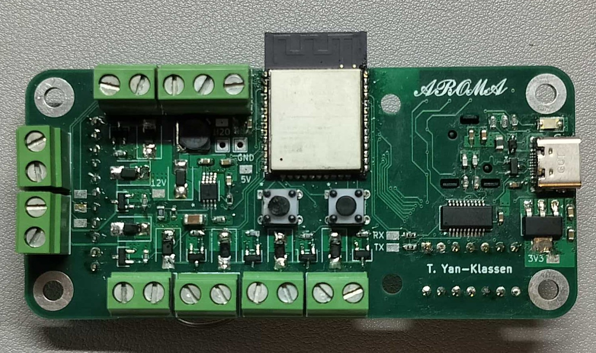
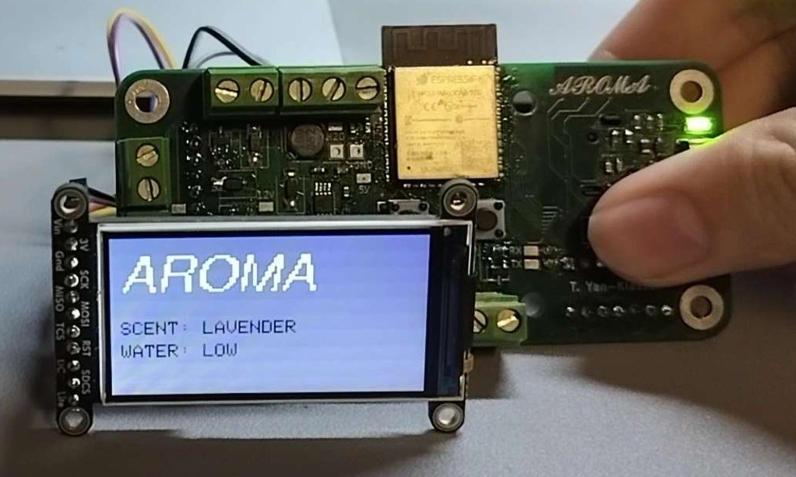

# Aroma Control Board

  
  

**Aroma Controller** is a compact ESP32 project that drives a multi‑scent diffuser with an intuitive on‑device UI. A five‑way joystick selects between an **OFF** state and several active scent profiles, while a small SPI TFT displays the current mode and status. The goal is a clean, responsive interface that runs untethered and can be extended with timers or profiles.

The firmware uses a debounced state machine so each joystick action cleanly toggles its corresponding scent. A simple analog water‑level input is monitored and shown on screen to avoid running dry. The display presents a title view and per‑scent screens with distinct themes, and draw calls are kept lightweight to minimize tearing on the SPI bus.

The board is powered and programmed over **USB‑C** for easy access, with programming handled by an onboard **USB‑to‑UART** converter. An onboard **boost converter** generates 12 V to drive **five pump channels** (five total scents), and a **5 V fan** automatically runs whenever any pump is active. The board also integrates the analog water sensor, debounced joystick input, and a color SPI TFT (ST7789, 1.9″ 320×170).